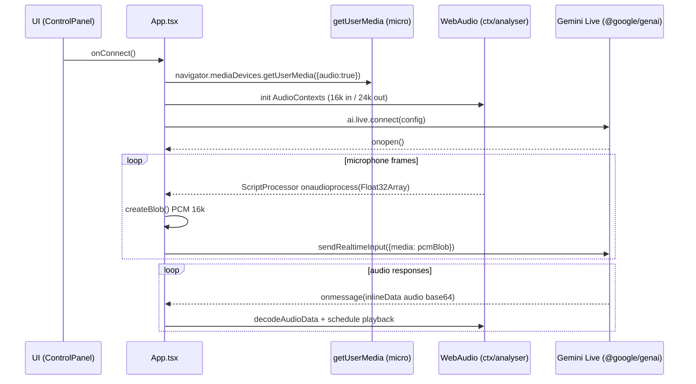
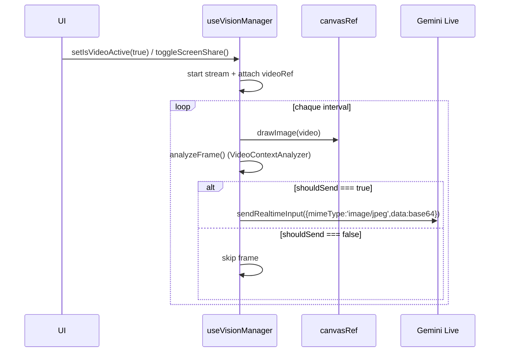

# ARCHITECTURE — NeuroChat Pro

Ce document décrit l’architecture **réelle** du projet tel qu’il existe dans ce dépôt (frontend uniquement), ainsi que des recommandations pour une architecture “production-ready”.

---

## 1) Vue d’ensemble

### Ce que contient ce repo

- **Frontend**: application React (Vite) qui orchestre une session **Gemini Live** (streaming audio bidirectionnel) + vision (caméra / partage écran) + outils “function calling”.
- **Stockage**: `localStorage` (notes, agenda, heures, préférences, documents uploadés, personnalité, etc.).
- **Pas de backend / DB** dans ce dépôt.

### À propos de l’API Key

Dans l’état actuel, la clé `GEMINI_API_KEY` est injectée dans le frontend via `vite.config.ts` (`define: process.env.API_KEY`).  
Cela convient pour un usage local / démo, mais **pas** pour une mise en production publique (la clé peut être extraite du bundle).

---

## 2) Diagrammes

### 2.1 Diagramme de composants (frontend)

```mermaid
graph TD
  App[App.tsx]
  Status[hooks/useStatusManager.ts]
  AudioMgr[hooks/useAudioManager.ts]
  VisionMgr[hooks/useVisionManager.ts]
  LS[hooks/useLocalStorageState.ts]

  Control[components/ControlPanel.tsx]
  Viz[components/Visualizer.tsx]
  Video[components/VideoOverlay.tsx]
  Header[components/Header.tsx]
  Toast[components/Toast.tsx]
  Notes[components/NotesViewer.tsx]
  Agenda[components/AgendaViewer.tsx]
  Tasks[components/TasksViewer.tsx]
  ToolsList[components/ToolsList.tsx]

  Tools[utils/tools.ts]
  AudioUtils[utils/audioUtils.ts]
  DocProc[utils/documentProcessor.ts]
  SysCfg[systemConfig.ts]
  VCA[utils/videoContextAnalyzer.ts]
  Wake[utils/wakeWordDetector.ts]

  Gemini[@google/genai - Gemini Live]

  App --> Status
  App --> AudioMgr
  App --> VisionMgr
  App --> LS

  App --> Control
  App --> Header
  App --> Viz
  App --> Video
  App --> Toast
  App --> Notes
  App --> Agenda
  App --> Tasks
  App --> ToolsList

  App --> Gemini
  App --> AudioUtils
  App --> DocProc
  App --> SysCfg
  App --> Wake
  VisionMgr --> VCA
  App --> Tools
```

### 2.2 Séquence — Connexion + streaming audio



### 2.3 Séquence — Vision (caméra / partage d’écran)



---

## 3) Frontend — responsabilités par module

### 3.1 `App.tsx`

Responsabilités principales:
- cycle de vie de la **session Gemini Live** (connect/disconnect/reconnect)
- pipeline audio (micro → PCM → WebSocket)
- playback audio (base64 → AudioBuffer → scheduling)
- intégration tool-calling (réception `toolCall` → `executeFunction()` → `sendToolResponse()`)
- orchestration vision via `useVisionManager`
- persistance (personnalité, docs, toggles) via `useLocalStorageState`
- layout UI (header, sidebar, dock central, overlays)

### 3.2 Hooks

- `useStatusManager`: état de connexion + latence + toasts
- `useAudioManager`: activation du contexte audio + bip
- `useVisionManager`: caméra/screen share + capture + analyse + envoi vers Gemini
- `useLocalStorageState`: abstraction robuste de `localStorage` (fallback + sérialisation)

### 3.3 Outils (tool calling)

Fichier: `utils/tools.ts`
- Déclare les fonctions exposées au modèle (`AVAILABLE_FUNCTIONS`)
- Exécute localement (`executeFunction`) des actions:
  - notes (`neurochat_notes`)
  - agenda (`neurochat_events`)
  - heures de travail (`neurochat_work_hours`)
  - utilitaires (calcul, conversions, etc.)

---

## 4) Backend / DB (état actuel vs recommandé)

### État actuel (dans ce dépôt)

- **Backend**: aucun
- **DB**: aucune
- **Persistance**: `localStorage`
- **Clé API**: injectée côté client (⚠️ non recommandé en prod publique)

### Recommandation production (architecture cible)

```mermaid
graph TD
  FE[Frontend (Vite/React)]
  BE[Backend proxy (Serverless/Edge)]
  Secret[(Secret Manager)]
  Gemini[Gemini Live API]
  Store[(DB / KV / Object Storage)]

  FE -->|auth| BE
  BE --> Secret
  BE -->|WebSocket/stream| Gemini
  BE --> Store
```

Recommandations:
- **Proxy backend** pour signer/relayer les appels Gemini Live (clé jamais exposée)
- **Auth** (ex: OAuth/Firebase/Supabase) si l’app est multi-utilisateurs
- **Stockage**:
  - `IndexedDB` (offline) ou
  - DB (Postgres) + stockage objet (S3/GCS) pour documents
- **Observabilité**: logs structurés + Sentry + métriques latence/erreurs

---

## 5) PWA

Le projet utilise `vite-plugin-pwa`:
- `manifest` configuré (icônes, shortcuts)
- `workbox` runtime caching (fonts + appels vers `generativelanguage.googleapis.com`)

---

## 6) Risques & points d’attention

- **Sécurité clé API**: à corriger avant production publique
- **`localStorage`**:
  - capacité limitée
  - pas de chiffrement
  - pas de multi-device sync
- **Audio**:
  - contraintes navigateur (HTTPS/localhost)
  - latence variable selon device
- **Vision**:
  - coût CPU (canvas + encodage)
  - permissions et UX consentement


