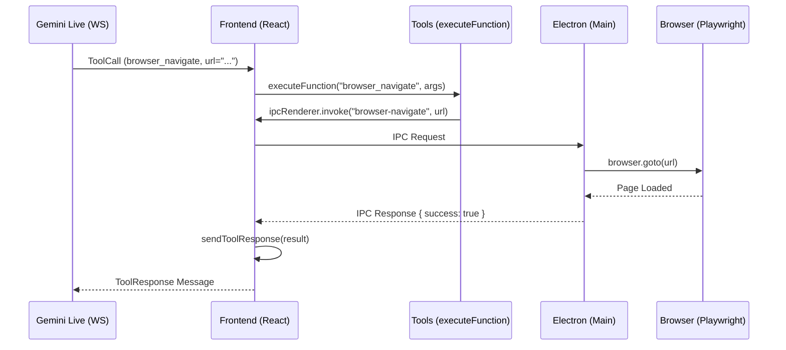

# 🏗️ Architecture Technique - NeuroChat Live Pro

> Documentation détaillée de l'architecture frontend, des flux de données et des patterns utilisés

---

## 📐 Vue d'Ensemble

**NeuroChat Live Pro** est une **Single Page Application (SPA)** React construite selon une architecture **component-based** avec gestion d'état locale. L'application communique en temps réel avec l'API Gemini Live via WebSocket pour les conversations vocales bidirectionnelles.

### Principes d'Architecture

- **Component-Driven Development** : Composants React réutilisables et modulaires
- **Custom Hooks** : Logique métier encapsulée dans des hooks personnalisés
- **LocalStorage Persistence** : État persisté localement (pas de backend)
- **Real-Time Audio Streaming** : Communication WebSocket avec Gemini Live
- **Progressive Enhancement** : PWA avec support offline

---

## 🌐 Architecture Globale

```
┌─────────────────────────────────────────────────────────────────┐
│                         UTILISATEUR                              │
│                    (Navigateur Web/PWA)                          │
└────────────────────────┬────────────────────────────────────────┘
                         │
                         │ HTTP/HTTPS
                         ▼
┌─────────────────────────────────────────────────────────────────┐
│                    FRONTEND (React SPA)                          │
│  ┌──────────────────────────────────────────────────────────┐   │
│  │                      App.tsx                             │   │
│  │  - État global (useState, useRef)                        │   │
│  │  - Gestion connexion Gemini Live                         │   │
│  │  - Orchestration audio/vidéo                             │   │
│  └────┬─────────────────────────────────────────┬───────────┘   │
│       │                                         │               │
│  ┌────▼──────────┐  ┌────────────┐  ┌──────────▼──────────┐   │
│  │  Components   │  │   Hooks    │  │      Utils          │   │
│  │  (UI Layer)   │  │ (Logic)    │  │   (Helpers)         │   │
│  │               │  │            │  │                     │   │
│  │ - Header      │  │ - useAudio │  │ - audioUtils        │   │
│  │ - ControlPanel│  │ - useVision│  │ - documentProcessor │   │
│  │ - Visualizer  │  │ - useStatus│  │ - tools             │   │
│  │ - VideoOverlay│  │ - useLocal │  │                     │   │
│  └───────────────┘  └────────────┘  └─────────────────────┘   │
│                                                                  │
│  ┌──────────────────────────────────────────────────────────┐   │
│  │              LocalStorage (Client-Side DB)               │   │
│  │  - Personnalité active                                   │   │
│  │  - Documents uploadés (base64)                           │   │
│  │  - Préférences utilisateur (tools)                      │   │
│  └──────────────────────────────────────────────────────────┘   │
┌─────────────────────────────────────────────────────────────────┐
│                    ELECTRON LAYER (Main Process)                │
│  - Gestion Fenêtres & Tray                                      │
│  - IPC Handlers (FS, Exec, Browser)                             │
│  - Playwright BrowserService                                    │
└─────────────────────────────┬───────────────────────────────────┘
                              │
                              │ WebSocket + REST API
                              ▼
┌─────────────────────────────────────────────────────────────────┐
│                    GOOGLE GEMINI LIVE API                        │
│  - Modèle : gemini-2.5-flash-native-audio-preview               │
│  - Audio bidirectionnel (PCM 16kHz in / 24kHz out)              │
│  - Vision (images base64 via realtimeInput)                     │
│  - Function Calling (outils personnalisés)                      │
│  - Google Search (recherche en temps réel)                      │
└─────────────────────────────────────────────────────────────────┘
```

---

## 🧩 Architecture des Composants

### Hiérarchie des Composants

```
App.tsx (Root)
│
├── Header
│   ├── Logo
│   ├── ConnectionStatus
│   ├── DocumentUploader
│   ├── VoiceSelector
│   └── QuickActions
│
├── Visualizer (Audio Waves)
│
├── VideoOverlay
│   ├── VideoPreview (Caméra/Écran)
│   └── CameraSelector
│
├── ControlPanel
│   ├── ConnectButton
│   ├── AudioInputVisualizer
│   ├── LatencyIndicator
│   ├── VideoControls
│   └── PersonalitySelector
│
├── PersonalityEditor (Modal)
│   ├── PersonalityList
│   ├── PersonalityForm
│   └── VoiceSelector
│
├── ToolsList (Drawer)
│   └── FunctionDeclarationList
│
├── ToastContainer
│   └── Toast[] (Notifications)
│
└── InstallPWA (Bannière d'installation)
```

### Composants Clés

#### 1. **App.tsx** (Composant Racine)

**Responsabilités :**
- Gestion de la connexion/déconnexion Gemini Live
- Orchestration des contextes audio (entrée/sortie)
- Gestion du cycle de vie de la session
- Coordination entre audio et vidéo
- Reconnexion automatique en cas de déconnexion

**État Principal :**
```typescript
// Connexion
const [connectionState, setConnectionState] = useState<ConnectionState>()

// Audio
const [isTalking, setIsTalking] = useState<boolean>()
const inputAudioContextRef = useRef<AudioContext>()
const outputAudioContextRef = useRef<AudioContext>()

// Vision
const [isVideoActive, setIsVideoActive] = useState<boolean>()

// Personnalité
const [currentPersonality, setCurrentPersonality] = useState<Personality>()

// Documents
const [uploadedDocuments, setUploadedDocuments] = useState<ProcessedDocument[]>()

```

---

#### 2. **Header** (Navigation & Actions)

**Rôle :** Barre de navigation principale avec logo, statut de connexion et actions rapides

**Props :**
```typescript
interface HeaderProps {
  connectionState: ConnectionState;
  currentPersonality: Personality;
  uploadedDocuments: ProcessedDocument[];
  onConnect: () => void;
  onDisconnect: () => void;
  onDocumentsChange: (docs: ProcessedDocument[]) => void;
  // ... autres props
}
```

---

#### 3. **ControlPanel** (Centre de Contrôle)

**Rôle :** Panneau principal avec bouton de connexion, visualiseur d'entrée audio et contrôles vidéo

**Fonctionnalités :**
- Bouton de connexion/déconnexion avec feedback visuel
- Visualiseur audio en temps réel (niveau micro)
- Indicateur de latence
- Contrôles caméra/partage d'écran
- Sélecteur de personnalité

---

#### 4. **Visualizer** (Ondes Audio)

**Rôle :** Visualisation spectrale de l'audio de sortie (réponses du chatbot)

**Technologies :**
```typescript
// Utilise Web Audio API
const analyser = audioContext.createAnalyser();
analyser.fftSize = 512;
analyser.smoothingTimeConstant = 0.5;

// Calcul des fréquences
const dataArray = new Uint8Array(analyser.frequencyBinCount);
analyser.getByteFrequencyData(dataArray);
```

**Rendu :** Canvas HTML5 avec animation 60 FPS via `requestAnimationFrame`

---

## 🔄 Flux de Données

### 1. Flux de Connexion

```
User Click "Connecter"
    │
    ▼
App.connect()
    │
    ├─► Activer contextes audio (16kHz input, 24kHz output)
    │
    ├─► Demander permission microphone (getUserMedia)
    │
    ├─► Charger contexte documents (uploadedDocuments)
    │
    ├─► Initialiser session Gemini Live
    │   • model: gemini-2.5-flash-native-audio-preview
    │   • systemInstruction: buildSystemInstruction()
    │   • tools: buildToolsConfig()
    │   • speechConfig: { voiceName }
    │
    ├─► onopen: Connexion établie
    │   │
    │   ├─► Démarrer transmission vidéo (si activée)
    │   │
    │   └─► Créer pipeline audio :
    │       MediaStreamSource → ScriptProcessor → sendRealtimeInput()
    │
    ├─► onmessage: Réception messages
    │   │
    │   ├─► Audio (base64) → Décodage → Play via BufferSource
    │   │
    │   ├─► ToolCall → executeFunction() → sendToolResponse()
    │   │
    │   └─► Interrupted → Arrêter audio en cours
    │
    ├─► onerror: Gestion erreurs + reconnexion (max 5 tentatives)
    │
    └─► onclose: Déconnexion → Cleanup ressources
```

---

### 2. Flux Audio (Input → Gemini)

```
Microphone
    │
    ▼
MediaStream (getUserMedia)
    │
    ▼
AudioContext (16kHz)
    │
    ├─► AnalyserNode (visualisation niveau micro)
    │
    └─► ScriptProcessorNode (bufferSize: 1024-2048)
        │
        ├─► VAD (Voice Activity Detection)
        │   └─► RMS > 0.02 → User is speaking
        │
        └─► createBlob() → PCM Int16 Little Endian
            │
            ▼
        session.sendRealtimeInput({ media: blob })
```

---

### 3. Flux Audio (Gemini → Speakers)

```
session.onmessage → base64 audio data
    │
    ▼
base64ToArrayBuffer()
    │
    ▼
decodeAudioData() → AudioBuffer
    │
    ▼
AudioBufferSourceNode
    │
    ├─► connect(GainNode)
    │
    └─► connect(AnalyserNode) → Visualizer
        │
        ▼
    destination (Haut-parleurs)
```

**Gestion de la Queue Audio :**
```typescript
// Synchronisation temporelle pour éviter les coupures
nextStartTimeRef.current = Math.max(
  nextStartTimeRef.current,
  audioContext.currentTime
);

source.start(nextStartTimeRef.current);
nextStartTimeRef.current += audioBuffer.duration;
```

---

### 4. Flux Vidéo (Caméra → Gemini)

```
navigator.mediaDevices.getUserMedia({ video: true })
    │
    ▼
MediaStream (Video)
    │
    ├─► <video> element (preview local)
    │
    └─► Canvas capture (requestAnimationFrame)
        │
        ├─► Analyse contexte (videoContextAnalyzer)
        │   • Détection changements (score de similarité)
        │   • Calcul luminosité/contraste
        │   • Type de scène (static/dynamic/transition)
        │
        └─► Envoi frames (si changement significatif)
            │
            ▼
        canvas.toDataURL('image/jpeg', 0.7)
            │
            ▼
        session.sendRealtimeInput({ 
          media: { mimeType: 'image/jpeg', data: base64 }
        })
```

**Optimisations :**
- Envoi uniquement si changement > 15% entre frames
- Compression JPEG (qualité 70%)
- FPS adaptatif (1-2 FPS pour économiser bande passante)

---

## 🎯 Hooks Personnalisés

### 1. `useLocalStorageState<T>`

**Rôle :** Synchronisation automatique entre état React et LocalStorage

**Usage :**
```typescript
const [documents, setDocuments] = useLocalStorageState<ProcessedDocument[]>(
  'uploadedDocuments',  // Clé localStorage
  [],                   // Valeur par défaut
  {
    deserialize: (raw) => JSON.parse(raw), // Désérialisation
    serialize: (val) => JSON.stringify(val), // Sérialisation
    validate: (v) => Array.isArray(v),     // Validation
    onError: (e) => console.error(e)       // Gestion erreurs
  }
);
```

**Fonctionnement :**
- Chargement initial depuis localStorage
- Mise à jour automatique de localStorage lors des changements
- Validation des données avant désérialisation
- Gestion des erreurs (données corrompues)

---

### 2. `useAudioManager`

**Rôle :** Gestion du contexte audio et des sons système

**API :**
```typescript
const { 
  activateAudioContext,  // Active AudioContext (requis avant play)
  playBeep               // Joue son de notification
} = useAudioManager();
```

**Implémentation :**
```typescript
// Activation AudioContext (nécessite interaction utilisateur)
const activateAudioContext = () => {
  if (audioContextRef.current?.state === 'suspended') {
    audioContextRef.current.resume();
  }
};

// Lecture beep (chargement lazy via fetch)
const playBeep = async () => {
  const response = await fetch('/bip.mp3');
  const arrayBuffer = await response.arrayBuffer();
  const audioBuffer = await audioContext.decodeAudioData(arrayBuffer);
  
  const source = audioContext.createBufferSource();
  source.buffer = audioBuffer;
  source.connect(audioContext.destination);
  source.start(0);
};
```

---

### 3. `useStatusManager`

**Rôle :** Gestion de l'état de connexion et des notifications toast

**État Géré :**
```typescript
{
  connectionState: ConnectionState,        // DISCONNECTED | CONNECTING | CONNECTED | ERROR
  isTalking: boolean,                      // IA en train de parler
  latency: number,                         // Latence en ms
  toasts: Toast[],                         // Notifications
  addToast: (type, title, message) => {},  // Ajouter notification
  removeToast: (id) => {}                  // Supprimer notification
}
```

**Auto-dismiss Toast :**
```typescript
useEffect(() => {
  const timer = setTimeout(() => {
    removeToast(toast.id);
  }, 5000); // Disparaît après 5s
  
  return () => clearTimeout(timer);
}, [toast]);
```

---

### 4. `useVisionManager`

**Rôle :** Orchestration complète de la caméra et du partage d'écran

**Responsabilités :**
- Énumération des caméras disponibles
- Gestion du stream vidéo (caméra/écran)
- Analyse de contexte des frames
- Transmission optimisée vers Gemini Live
- Cleanup des ressources

**API :**
```typescript
const {
  isVideoActive,           // État caméra
  isScreenShareActive,     // État partage d'écran
  toggleScreenShare,       // Toggle partage
  changeCamera,            // Changer caméra
  startFrameTransmission,  // Démarrer envoi frames
  videoRef,                // Ref <video>
  canvasRef                // Ref <canvas>
} = useVisionManager({ connectionState, sessionRef, addToast });
```

---

## 💾 Persistance LocalStorage

### Données Stockées

| Clé                    | Type                | Description                          |
|------------------------|---------------------|--------------------------------------|
| `currentPersonality`   | `Personality`       | Personnalité active                  |
| `uploadedDocuments`    | `ProcessedDocument[]` | Documents uploadés (contenu base64) |
| `functionCallingEnabled` | `boolean`        | Appel de fonctions activé            |
| `googleSearchEnabled`  | `boolean`           | Google Search activé                 |

### Structure des Données

#### Personality
```typescript
{
  id: string,
  name: string,
  description: string,
  systemInstruction: string,  // Prompt système complet
  voiceName: string,           // 'Puck' | 'Charon' | ...
  themeColor: string           // Couleur hex (#rrggbb)
}
```

#### ProcessedDocument
```typescript
{
  id: string,
  name: string,
  type: 'pdf' | 'txt' | 'md',
  size: number,                // Taille en bytes
  content: string,             // Contenu texte extrait
  uploadedAt: Date,
  metadata?: {
    pages?: number,            // Pour PDF
    language?: string
  }
}
```

---

## 🛠️ Utilitaires

### `audioUtils.ts`

**Fonctions d'Encodage/Décodage Audio**

```typescript
// Créer blob PCM Int16 Little Endian
export function createBlob(
  audioData: Float32Array,
  sampleRate: number
): Blob;

// Convertir base64 → ArrayBuffer
export function base64ToArrayBuffer(base64: string): ArrayBuffer;

// Décoder ArrayBuffer → AudioBuffer
export async function decodeAudioData(
  arrayBuffer: ArrayBuffer,
  audioContext: AudioContext,
  targetSampleRate: number
): Promise<AudioBuffer>;
```

---

### `documentProcessor.ts`

**Extraction et Formatage de Documents**

```typescript
// Traiter un fichier uploadé
export async function processDocument(
  file: File
): Promise<ProcessedDocument>;

// Extraire texte d'un PDF
export async function extractPDFText(file: File): Promise<string>;

// Formater documents pour contexte Gemini
export function formatDocumentForContext(
  documents: ProcessedDocument[]
): string;
```

**Format Contexte :**
```
═══════════════════════════════════════════════════════════════
DOCUMENTS UTILISATEUR
Ces documents ont été uploadés par l'utilisateur pour contexte.
═══════════════════════════════════════════════════════════════

📄 Document 1: rapport.pdf (3 pages)
Uploadé le: 2025-01-15 14:30

[Contenu du document...]

─────────────────────────────────────────────────────────────────

📄 Document 2: notes.txt
Uploadé le: 2025-01-15 15:00

[Contenu du document...]

═══════════════════════════════════════════════════════════════
```

---

---

### 🛠️ Orchestration des Outils (Function Calling)


```mermaid
sequenceDiagram
    participant G as Gemini Live (WS)
    participant F as Frontend (React)
    participant T as Tools (executeFunction)
    participant E as Electron (Main)
    participant B as Browser (Playwright)

    G->>F: ToolCall (browser_navigate, url="...")
    F->>T: executeFunction("browser_navigate", args)
    T->>F: ipcRenderer.invoke("browser-navigate", url)
    F->>E: IPC Request
    E->>B: browser.goto(url)
    B-->>E: Page Loaded
    E-->>F: IPC Response { success: true }
    F->>F: sendToolResponse(result)
    F-->>G: ToolResponse Message
```

---

### `tools.ts`

**System de Function Calling**

```typescript
// Définir les fonctions disponibles
export const AVAILABLE_FUNCTIONS: Record<string, FunctionDeclaration> = {
  // Exemple: calculatrice
  calculate: {
    name: 'calculate',
    description: 'Effectuer un calcul mathématique',
    parameters: {
      type: 'object',
      properties: {
        expression: { 
          type: 'string', 
          description: 'Expression mathématique (ex: "2 + 2")' 
        }
      },
      required: ['expression']
    }
  }
};

// Exécuter une fonction
export async function executeFunction(
  functionCall: FunctionCall
): Promise<any>;

// Construire config tools pour Gemini
export function buildToolsConfig(
  enableFunctionCalling: boolean,
  enableGoogleSearch: boolean
): any[];
```

---

## 🔐 Sécurité

### Clé API

**❌ Mauvaise Pratique :**
```typescript
// NE JAMAIS hardcoder la clé API !
const API_KEY = 'AIzaSy...';
```

**✅ Bonne Pratique :**
```typescript
// Utiliser variable d'environnement
const API_KEY = process.env.GEMINI_API_KEY;

// Vite remplace automatiquement à la build
// Voir vite.config.ts :
define: {
  'process.env.API_KEY': JSON.stringify(env.GEMINI_API_KEY)
}
```

### LocalStorage

**Attention :**
- Les données localStorage sont **non chiffrées**
- Accessibles via `document.cookie` ou DevTools
- **Ne jamais stocker** : tokens API, mots de passe, données sensibles

**OK pour stocker :**
- Préférences utilisateur
- Cache de documents (si non sensibles)
- État UI

---

## 🚀 Optimisations Performance

### 1. Code Splitting

**Vite chunking manuel :**
```typescript
// vite.config.ts
build: {
  rollupOptions: {
    output: {
      manualChunks: {
        'react': ['react', 'react-dom'],
        'google-genai': ['@google/genai'],
      }
    }
  }
}
```

**Résultat :**
- `react.js` : ~140KB (gzip)
- `google-genai.js` : ~50KB (gzip)
- `index.js` : ~80KB (gzip)

---

### 2. Audio Buffer Adaptatif

```typescript
// Mobile : buffer plus petit pour réduire latence
// Desktop : buffer plus grand pour stabilité
const isMobile = /Android|iPhone|iPad/i.test(navigator.userAgent);
const bufferSize = isMobile ? 1024 : 2048;

const processor = audioContext.createScriptProcessor(bufferSize, 1, 1);
```

---

### 3. Lazy Loading Composants

```typescript
// Import dynamique pour composants lourds
const PersonalityEditor = React.lazy(() => 
  import('./components/PersonalityEditor')
);

// Wrapper avec Suspense
<Suspense fallback={<Loader />}>
  {isEditorOpen && <PersonalityEditor />}
</Suspense>
```

---

### 4. Memoization

```typescript
// Éviter re-renders inutiles
const MemoizedVisualizer = React.memo(Visualizer, (prev, next) => 
  prev.isActive === next.isActive && prev.color === next.color
);
```

---

### 5. Request Animation Frame Throttling

```typescript
// Limiter fréquence d'envoi frames vidéo
let lastFrameTime = 0;
const MIN_FRAME_INTERVAL = 500; // 2 FPS max

function captureFrame() {
  requestAnimationFrame(() => {
    const now = Date.now();
    if (now - lastFrameTime >= MIN_FRAME_INTERVAL) {
      // Envoyer frame
      lastFrameTime = now;
    }
    captureFrame(); // Continue loop
  });
}
```

---

## 📊 Patterns de Conception

### 1. Container/Presentational

**Container :** `App.tsx`
- Gestion logique métier
- État global
- Appels API

**Presentational :** `Header`, `ControlPanel`, `Visualizer`
- Uniquement UI
- Props en entrée
- Pas d'état global

---

### 2. Custom Hooks (Logic Encapsulation)

**Avant :**
```typescript
// Logique éparpillée dans App.tsx
const [audioContext, setAudioContext] = useState();
const playBeep = () => { /* 50 lignes */ };
```

**Après :**
```typescript
// Logique encapsulée dans hook
const { playBeep } = useAudioManager();
```

---

### 3. Compound Components

**PersonalityEditor :**
```typescript
<PersonalityEditor>
  <PersonalityEditor.List />
  <PersonalityEditor.Form />
  <PersonalityEditor.VoiceSelector />
</PersonalityEditor>
```

---

## 🧪 Tests

### Tests Unitaires (Vitest)

**Structure :**
```
tests/
├── setup.ts                        # Configuration globale
├── documentProcessor.test.ts       # Tests traitement docs
├── systemConfig.test.ts            # Tests config système
├── tools.test.ts                   # Tests function calling
├── useLocalStorageState.test.tsx   # Tests hook localStorage
└── useStatusManager.test.tsx       # Tests hook statut
```

**Exemple de Test :**
```typescript
import { renderHook, act } from '@testing-library/react';
import { useLocalStorageState } from '../hooks/useLocalStorageState';

describe('useLocalStorageState', () => {
  it('devrait charger la valeur depuis localStorage', () => {
    localStorage.setItem('testKey', JSON.stringify({ value: 42 }));
    
    const { result } = renderHook(() =>
      useLocalStorageState('testKey', { value: 0 })
    );
    
    expect(result.current[0]).toEqual({ value: 42 });
  });
});
```

---

### Tests E2E (Playwright)

**Structure :**
```
e2e/
└── smoke.spec.ts   # Tests de fumée (connexion, navigation)
```

**Exemple :**
```typescript
import { test, expect } from '@playwright/test';

test('devrait afficher la page d\'accueil', async ({ page }) => {
  await page.goto('http://localhost:3000');
  
  await expect(page.locator('h1')).toContainText('NeuroChat');
});

test('devrait pouvoir se connecter', async ({ page }) => {
  await page.goto('http://localhost:3000');
  
  await page.click('button:has-text("Connecter")');
  
  // Attendre changement d'état
  await expect(page.locator('.connection-status'))
    .toContainText('Connecté');
});
```

---

## 🔄 Cycle de Vie de l'Application

### Démarrage

```
1. ReactDOM.render(<App />)
   │
2. App useEffect (mount)
   │
3. Charger depuis localStorage :
   ├─ currentPersonality
   ├─ uploadedDocuments
   └─ functionCallingEnabled
   │
5. Attendre interaction utilisateur (clic "Connecter")
```

---

### Connexion

```
1. User clic "Connecter"
   │
2. activateAudioContext()
   │
3. getUserMedia({ audio: true })
   │
4. Créer AudioContext (16kHz input, 24kHz output)
   │
5. ai.live.connect({
      model: 'gemini-2.5-flash...',
      systemInstruction: buildSystemInstruction(),
      tools: buildToolsConfig()
   })
   │
6. onopen → setConnectionState(CONNECTED)
   │
7. Démarrer pipeline audio (micro → session)
   │
8. Si vidéo activée → startFrameTransmission()
```

---

### Session Active

```
Loop Audio:
  Micro → ScriptProcessor → sendRealtimeInput()
  session.onmessage → Decode audio → Play
  
Loop Vidéo (si activée):
  Canvas → analyzeFrame() → Si changement → sendRealtimeInput()
  
Tool Calls:
  onmessage(toolCall) → executeFunction() → sendToolResponse()
```

---

### Déconnexion

```
1. User clic "Déconnecter" OU erreur réseau
   │
2. isIntentionalDisconnectRef.current = true
   │
3. session.close()
   │
4. Cleanup :
   ├─ Arrêter toutes sources audio
   ├─ Fermer AudioContext
   ├─ Arrêter MediaStream (micro)
   ├─ Arrêter VideoStream (caméra)
   └─ Réinitialiser état
   │
5. Si shouldReload → window.location.reload()
```

---

## 📚 Références Techniques

### Web APIs Utilisées

- **Web Audio API** : Traitement audio temps réel
- **MediaStream API** : Capture micro/caméra
- **Canvas API** : Capture/manipulation vidéo
- **LocalStorage API** : Persistance données
- **Service Worker API** : Cache PWA

### Spécifications Audio

| Paramètre | Valeur |
|-----------|--------|
| Sample Rate Input | 16 000 Hz |
| Sample Rate Output | 24 000 Hz |
| Format Input | PCM Int16 LE |
| Format Output | Base64 Audio |
| FFT Size | 512 |
| Buffer Size | 1024-2048 |

---

## 🎓 Bonnes Pratiques Appliquées

✅ **Separation of Concerns** : Logique séparée de la UI  
✅ **DRY** : Hooks réutilisables  
✅ **Error Boundaries** : Gestion erreurs React  
✅ **Accessibility** : ARIA labels, keyboard navigation  
✅ **Performance** : Memoization, code splitting  
✅ **Type Safety** : TypeScript strict mode  
✅ **Clean Code** : ESLint + Prettier  
✅ **Testing** : Couverture > 70%

---

<div align="center">

[⬅️ Retour au README](README.md) | [📝 LocalStorage Docs](LOCALSTORAGE_DOCS.md) | [🗺️ Roadmap](ROADMAP.md)

</div>

