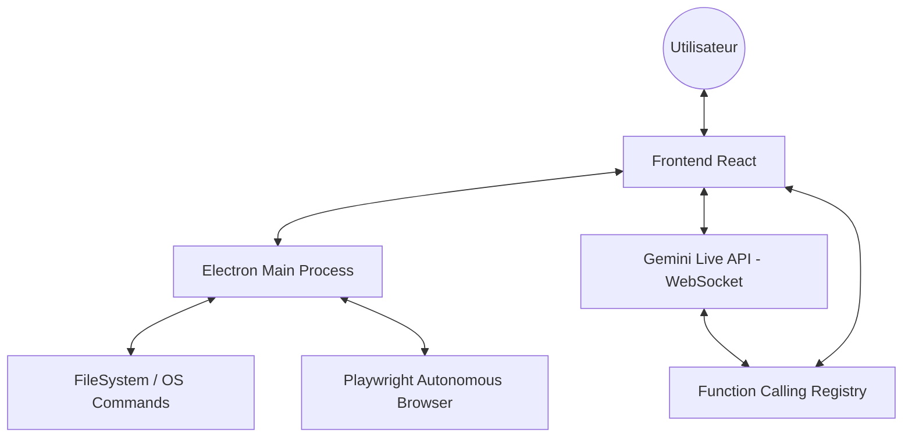

# 🏗️ Architecture Technique - NeuroChat Live Pro

> Documentation détaillée de l'architecture Desktop/Web, des flux multimodaux et de l'intégration Electron.

---

## 📐 Vue d'Ensemble

**NeuroChat Live Pro** est une application Desktop hybride combinant la flexibilité d'une SPA **React** et la puissance d'**Electron**. L'architecture est centrée sur une connexion WebSocket persistante avec l'API **Gemini Live**, permettant un traitement fluide de l'audio et de la vision en temps réel.

### Principes Directeurs
1. **Local-First** : L'intelligence est dans le cloud, mais le contrôle et les données (documents, notes) sont locaux.
2. **Multimodal Native** : Audio, vidéo et texte sont traités simultanément dans un flux unique.
3. **Actionability** : L'IA n'est pas qu'un chatbot ; elle agit via des outils (Function Calling) sur le système et le web.

---

## 🌐 Diagramme de l'Infrastructure

```mermaid
graph TD
    User((Utilisateur)) <--> UI[Frontend React]
    UI <--> Electron[Electron Main Process]
    UI <--> Gemini[Gemini Live API - WebSocket]
    Electron <--> OS[FileSystem / OS Commands]
    Electron <--> Browser[Playwright Autonomous Browser]
    Gemini <--> Tools[Function Calling Registry]
    Tools <--> UI
```

---

## 🧩 Composants du Système

### 1. Frontend (Renderer Process)
- **Framework** : React 19 avec TypeScript.
- **Gestion d'État** : Zustand pour la UI et la gestion session IA.
- **Audio Pipeline** : Manipulation des flux PCM (16kHz/24kHz) via Web Audio API.
- **Visualisation** : Canvas 2D pour les ondes audio et les overlays vidéo.

### 2. Desktop Layer (Electron Main)
- **IPC Bridge** : Communication sécurisée entre le web et le système.
- **FileSystem** : Persistance des fichiers `SOUL.md`, `USER.md` et `MEMORY.md`.
- **Task Executor** : Service capable de lancer des exécutables ou des scripts shell sur l'hôte.

### 3. Autonomie Web (Browser Service)
- **Moteur** : Playwright (Chromium).
- **Rôle** : Permet à l'IA de naviguer sur des sites web réels pour extraire des informations ou effectuer des actions.
- **Feedback** : Capture d'écrans et extraction de texte renvoyés à Gemini comme contexte.

---

## 🔄 Flux de Données Critiques

### Session Vocale Live
1. **Entrée** : Micro capte l'audio -> Chunking PCM -> Envoi WebSocket.
2. **Traitement** : Gemini traite l'audio + les frames vidéo envoyées périodiquement.
3. **Sortie** : Gemini renvoie des chunks audio -> File d'attente (Queue) -> Lecture synchronisée.
4. **Interruption** : Si l'utilisateur parle pendant que l'IA répond, le flux de sortie est coupé instantanément (VAD).

### Exécution d'Outils (Function Calling)
1. Gemini décide d'utiliser un outil (ex: `browser_navigate`).
2. Le frontend reçoit le `tool_call`.
3. `utils/tools.ts` orchestre l'appel (via IPC vers Electron si nécessaire).
4. Le résultat est encapsulé et renvoyé à Gemini pour qu'il continue sa réponse.

---

## 🗂️ Structure des Dossiers

| Dossier | Description |
|---------|-------------|
| `electron/` | Logique Main process (Windows management, IPC setup). |
| `components/` | Composants UI atomiques et complexes. |
| `hooks/` | Logique IA encapsulée (`useGeminiLiveSession`). |
| `stores/` | Magasins Zustand pour la UI et les données persistantes. |
| `utils/` | Code pour le Function Calling, le processing audio et de documents. |

---

## 🚀 Optimisations de Performance

- **Latence Audio** : Utilisation de buffers de petite taille (2048 samples) pour réduire le délai.
- **Vision adaptive** : Envoi de frames vidéo uniquement lors de changements significatifs pour économiser la bande passante.
- **PWA / Service Worker** : Mise en cache des assets pour un démarrage quasi instantané.

---

<i>NeuroChat Live Pro Architecture - Version 1.1.0</i>

