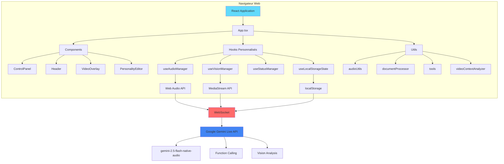
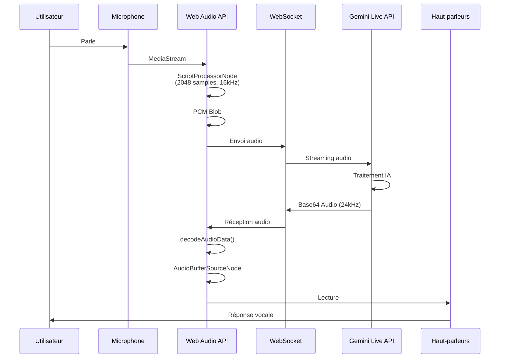
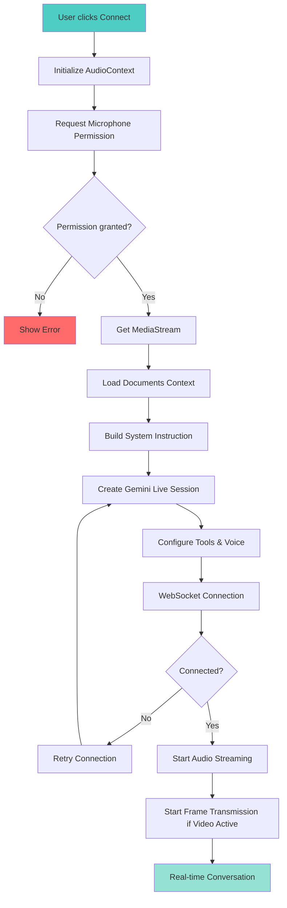
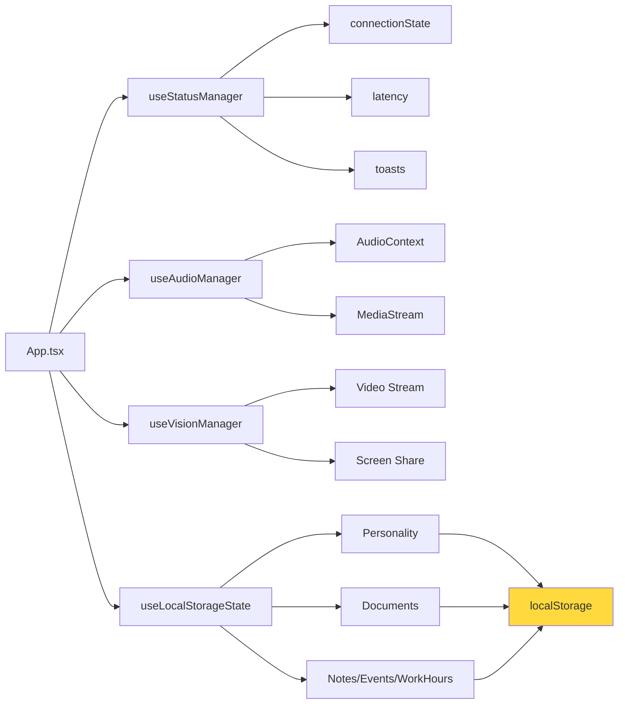

# 🧠 NeuroChat Live Pro

<div align="center">

**Assistant IA Multimodal Temps Réel • Conversations Vocales & Visuelles Ultra-Basse Latence**

[](https://react.dev)
[](https://www.typescriptlang.org)
[](https://vitejs.dev)
[](https://tailwindcss.com)
[](https://ai.google.dev)
[](https://web.dev/progressive-web-apps)

[](https://opensource.org/licenses/MIT)
[](http://makeapullrequest.com)

</div>

---

## 🎯 Introduction

**NeuroChat Live Pro** est une application frontend monolithique innovante qui révolutionne l'interaction avec l'intelligence artificielle en proposant des **conversations vocales et visuelles en temps réel** via l'API Google Gemini Live. 

Conçue comme une **Progressive Web App (PWA)**, l'application offre une expérience native sur desktop et mobile, avec une latence ultra-basse grâce à un pipeline audio optimisé et une architecture WebSocket directe avec Gemini.

### 💡 Concept

Imaginez un assistant IA qui :
- 🎤 **Parle avec vous** en temps réel avec une latence < 500ms
- 👁️ **Voit ce que vous voyez** via votre caméra ou partage d'écran
- 🎭 **S'adapte à votre personnalité** avec des assistants spécialisés configurables
- 📄 **Comprend vos documents** et les intègre dans la conversation
- 🔧 **Exécute des actions** via un système de Function Calling extensible
- 📱 **Fonctionne partout** comme une application native installable

**C'est exactement ce que NeuroChat Live Pro propose.**

---

## ✨ Fonctionnalités Clés

### 🎤 Conversation Vocale Ultra-Basse Latence

- **Streaming audio bidirectionnel** via WebSocket avec Google Gemini Live
- **Pipeline audio optimisé** : PCM Blobs (16 kHz input, 24 kHz output) pour une latence minimale
- **6 voix disponibles** : Puck, Charon, Kore, Fenrir, Zephyr, Aoede
- **Visualisation audio en temps réel** avec analyseur de fréquences
- **Détection de wake word** ("Bonjour") pour activation vocale hands-free
- **Indicateur de latence** en temps réel pour monitoring des performances

### 👁️ Vision en Temps Réel

- **Analyse vidéo live** via caméra frontale/arrière
- **Partage d'écran** pour analyse de contenu, interfaces, documents
- **Détection automatique des changements** de contexte visuel
- **Support multi-caméras** avec basculement dynamique
- **Analyse contextuelle intelligente** : détection de mouvement, texte, objets

### 🎭 Système de Personnalités Dynamiques

- **5 personnalités prédéfinies** :
  - 🕵️ **Analyste Cold Case** - Expert en résolution d'affaires non résolues
  - 🔍 **Auditeur SEO** - Spécialiste en optimisation de visibilité
  - 🛒 **Hunter E-com** - Expert en recherche de produits gagnants
  - 🎨 **Analyste Visuel** - Interprétation d'images et détection de détails
  - 📱 **Manager Social Media** - Stratégie de marketing social
- **Éditeur de personnalité** pour créer des assistants sur-mesure
- **Thèmes visuels** adaptés à chaque personnalité
- **Instructions système** combinant règles fondamentales + personnalité + documents

### 📄 Gestion de Documents Contextuels

- **Upload multi-formats** : PDF, TXT, MD, JSON, CSV, fichiers de code
- **Extraction automatique** du contenu textuel
- **Intégration dans le contexte** de conversation (jusqu'à 50k caractères par document)
- **Traitement asynchrone** avec feedback visuel
- **Gestion de plusieurs documents** simultanément

### 🔧 Outils de Productivité Intégrés (Function Calling)

Plus de **30 outils** disponibles via l'API Gemini Live :

#### 📝 Gestion de Contenu
- Notes et mémos (création, lecture, suppression)
- Agenda et événements (CRUD complet avec filtres)
- Suivi des heures travaillées (logging, résumés, statistiques)

#### 🧮 Calculs & Conversions
- Calculatrice mathématique avancée
- Conversion d'unités (température, longueur, poids, volume)
- Conversion de devises
- Calculs de pourcentages et pourboires

#### 🕐 Temps & Dates
- Heure et date actuelles
- Rappels et minuteurs
- Calcul d'âge et jours jusqu'à une date

#### 🛠️ Utilitaires
- Génération de mots de passe sécurisés
- Génération d'UUID
- Formatage de texte
- Comptage de mots/caractères
- Génération de nombres aléatoires
- Lancer de pièce et dés

#### 🔍 Recherche & Information
- Recherche Google en temps réel (optionnelle)
- Résumé de texte automatique
- Informations météo (simulation)

### 📱 Progressive Web App (PWA)

- **Installation native** sur desktop (Windows, macOS, Linux) et mobile (iOS, Android)
- **Mode standalone** sans barre d'adresse
- **Service Workers** pour cache intelligent et mode hors-ligne partiel
- **Notifications** et raccourcis d'actions rapides
- **Icônes adaptatives** (192x192, 512x512) avec support maskable

---

## 🛠️ Stack Technique Détaillée

### Frontend Core

| Technologie | Version | Usage |
|------------|---------|-------|
| **React** | 19.2.0 | Bibliothèque UI déclarative avec hooks |
| **TypeScript** | 5.8.2 | Typage statique pour robustesse |
| **Vite** | 6.2.0 | Build tool ultra-rapide avec HMR |
| **Tailwind CSS** | 3.4.15 | Framework CSS utilitaire pour UI moderne |

### API & Services

| Technologie | Version | Usage |
|------------|---------|-------|
| **@google/genai** | 1.30.0 | SDK officiel Google Gemini Live API |
| **Gemini 2.5 Flash Native Audio** | Preview | Modèle de conversation vocale temps réel |

### Audio & Media

| API | Usage |
|-----|-------|
| **Web Audio API** | Pipeline audio bidirectionnel (ScriptProcessorNode, AudioBuffer) |
| **MediaStream API** | Capture microphone et caméra (getUserMedia) |
| **Speech Recognition API** | Détection de wake word pour activation vocale |

### PWA & Build

| Technologie | Version | Usage |
|------------|---------|-------|
| **vite-plugin-pwa** | 1.1.0 | Support PWA avec Workbox (cache strategies) |
| **PostCSS** | 8.5.6 | Traitement CSS avec Autoprefixer |
| **Workbox** | Auto | Service Worker pour cache et offline |

### Gestion d'État & Persistance

- **localStorage** : Persistance des données utilisateur (notes, événements, heures, personnalités, documents)
- **React Hooks personnalisés** : `useLocalStorageState`, `useStatusManager`, `useAudioManager`, `useVisionManager`
- **Refs React** : Gestion des références pour accès synchrone aux états

---

## 🏗️ Architecture & Flux

### Vue d'Ensemble



### Pipeline Audio



### Flux de Connexion



### Gestion d'État



---

## 🚀 Installation & Setup

### Prérequis

- **Node.js** >= 18.0.0 (recommandé : LTS 20.x)
- **npm** >= 9.0.0 ou **yarn** >= 1.22.0
- **Clé API Google Gemini** ([Obtenir une clé](https://makersuite.google.com/app/apikey))
- **Navigateur moderne** avec support :
  - Web Audio API (Chrome 14+, Firefox 25+, Safari 6+)
  - MediaStream API (Chrome 53+, Firefox 36+, Safari 11+)
  - Speech Recognition API (Chrome/Edge uniquement)
  - Service Workers (pour PWA)

### Étape 1 : Cloner le Repository

```bash
git clone https://github.com/votre-username/NeuroChat-Live-Pro.git
cd NeuroChat-Live-Pro
```

### Étape 2 : Installer les Dépendances

```bash
npm install
```

**Note** : Si vous rencontrez des problèmes avec des dépendances optionnelles, vérifiez le fichier `.npmrc` pour la configuration des registres npm.

### Étape 3 : Configurer l'API Key

Créez un fichier `.env` à la racine du projet :

```bash
# .env
GEMINI_API_KEY=votre_cle_api_google_gemini_ici
```

**⚠️ Important** :
- Ne jamais commiter le fichier `.env` dans le repository (déjà dans `.gitignore`)
- La clé API est injectée dans le code via Vite au build time
- Pour la production, configurez les variables d'environnement sur votre plateforme d'hébergement

### Étape 4 : Lancer l'Application

#### Mode Développement

```bash
npm run dev
```

L'application sera accessible sur : `http://localhost:3000`

**Note** : Le serveur écoute sur `0.0.0.0:3000`, ce qui permet l'accès depuis d'autres appareils sur le réseau local (utile pour tester sur mobile).

#### Build de Production

```bash
npm run build
```

Les fichiers optimisés seront générés dans le dossier `dist/`.

#### Prévisualisation du Build

```bash
npm run preview
```

Permet de tester le build de production localement avant déploiement.

---

## 📱 Guide PWA : Installation sur Desktop et Mobile

### 🖥️ Installation sur Desktop

#### Windows / macOS / Linux (Chrome, Edge, Brave)

1. **Ouvrir l'application** dans votre navigateur
2. **Repérer l'icône d'installation** dans la barre d'adresse (icône "+" ou "Installer")
3. **Cliquer sur l'icône** ou utiliser le menu "Installer l'application"
4. **Confirmer l'installation** dans la popup
5. L'application apparaît dans votre menu Démarrer / Applications

**Alternative** : Menu → "Installer NeuroChat Live Pro..."

#### Firefox (Linux)

Firefox ne supporte pas encore l'installation PWA native, mais vous pouvez :
- Ajouter un raccourci manuel vers le site
- Utiliser Chrome/Edge pour une expérience PWA complète

### 📱 Installation sur Mobile

#### Android (Chrome)

1. **Ouvrir l'application** dans Chrome
2. **Menu** (⋮) → "Ajouter à l'écran d'accueil"
3. **Confirmer** l'ajout
4. L'icône apparaît sur l'écran d'accueil

**Alternative** : Une bannière d'installation peut apparaître automatiquement en bas de l'écran.

#### iOS (Safari)

1. **Ouvrir l'application** dans Safari
2. **Partager** (icône carrée avec flèche) → "Sur l'écran d'accueil"
3. **Personnaliser le nom** (optionnel)
4. **Ajouter** → L'icône apparaît sur l'écran d'accueil

**Note iOS** : Les PWA sur iOS ont certaines limitations (pas de notifications push natives, pas d'accès à certaines APIs).

### ✅ Vérifier l'Installation

Une fois installée, l'application :
- ✅ S'ouvre en **mode standalone** (sans barre d'adresse)
- ✅ Affiche son **icône** dans le launcher
- ✅ Fonctionne **hors-ligne** (partiellement, grâce au Service Worker)
- ✅ Se comporte comme une **application native**

### 🔄 Mise à Jour

Les mises à jour sont **automatiques** :
- Le Service Worker vérifie les mises à jour au démarrage
- Une notification peut apparaître pour recharger l'application
- Les assets sont mis en cache intelligemment (Workbox)

---

## 📁 Structure du Projet

```
NeuroChat-Live-Pro/
├── components/              # Composants React réutilisables
│   ├── AudioInputVisualizer.tsx    # Visualisation audio input
│   ├── ControlPanel.tsx            # Panneau de contrôle principal
│   ├── DocumentUploader.tsx        # Upload et gestion de documents
│   ├── Header.tsx                  # En-tête avec navigation
│   ├── InstallPWA.tsx              # Composant d'installation PWA
│   ├── LatencyIndicator.tsx        # Indicateur de latence
│   ├── Loader.tsx                  # Composant de chargement
│   ├── NotesViewer.tsx             # Visualiseur de notes
│   ├── PersonalityEditor.tsx       # Éditeur de personnalités
│   ├── PersonalitySelector.tsx     # Sélecteur de personnalités
│   ├── QuickStartGuide.tsx         # Guide de démarrage rapide
│   ├── Toast.tsx                   # Système de notifications
│   ├── ToolsList.tsx               # Liste des outils disponibles
│   ├── Tooltip.tsx                 # Tooltips
│   └── VideoOverlay.tsx            # Overlay vidéo/caméra
│
├── hooks/                  # Hooks React personnalisés
│   ├── useAudioManager.ts          # Gestion audio (context, beeps)
│   ├── useLocalStorageState.ts     # État persistant localStorage
│   ├── useStatusManager.ts         # Gestion état connexion/latence/toasts
│   └── useVisionManager.ts         # Gestion vision (caméra, screen share)
│
├── utils/                  # Utilitaires et helpers
│   ├── audioUtils.ts              # Utilitaires audio (PCM, decode)
│   ├── documentProcessor.ts        # Traitement documents (PDF, TXT, etc.)
│   ├── tools.ts                    # Définitions et exécution Function Calling
│   ├── videoContextAnalyzer.ts     # Analyse contexte vidéo
│   └── wakeWordDetector.ts         # Détection wake word
│
├── public/                 # Assets statiques
│   ├── bip.mp3, bip1.mp3           # Sons de notification
│   ├── favicon.ico                 # Favicon
│   ├── icon-192.png, icon-512.png  # Icônes PWA
│   └── logo.png, logo2.png         # Logos
│
├── dist/                   # Build de production (généré)
├── dev-dist/               # Build de développement (généré)
│
├── App.tsx                 # Composant principal (orchestration)
├── index.tsx               # Point d'entrée React
├── index.css               # Styles globaux Tailwind
├── index.html              # Template HTML
│
├── constants.ts            # Constantes (personnalités, voix, config)
├── systemConfig.ts         # Configuration système IA (instructions)
├── types.ts                # Types TypeScript globaux
│
├── package.json            # Dépendances et scripts
├── tsconfig.json           # Configuration TypeScript
├── tailwind.config.js      # Configuration Tailwind CSS
├── postcss.config.js       # Configuration PostCSS
├── vite.config.ts          # Configuration Vite (PWA, aliases)
├── LICENSE                 # Licence MIT
└── README.md               # Ce fichier
```

---

## 🔐 Configuration Avancée

### Variables d'Environnement

| Variable | Description | Requis | Exemple |
|----------|-------------|--------|---------|
| `GEMINI_API_KEY` | Clé API Google Gemini Live | ✅ Oui | `AIzaSy...` |

### Configuration Vite

Le fichier `vite.config.ts` configure :
- **Port** : `3000` (développement)
- **Host** : `0.0.0.0` (accessible depuis réseau local)
- **PWA** : Manifest, Service Worker, cache strategies
- **Alias** : `@` pointe vers la racine du projet
- **Chunking** : Séparation React et Google GenAI SDK

### Configuration Tailwind

Le fichier `tailwind.config.js` définit :
- **Thème personnalisé** avec couleurs et animations
- **Classes utilitaires** pour l'interface premium
- **Responsive breakpoints** pour mobile/desktop

---

## 🎯 Utilisation

### Première Connexion

1. **Configurer l'API Key** dans `.env`
2. **Lancer l'application** : `npm run dev`
3. **Autoriser l'accès au microphone** (popup navigateur)
4. **Sélectionner une personnalité** (optionnel)
5. **Cliquer sur "Connect"**
6. **Parler** : L'assistant répond en temps réel !

### Fonctionnalités Avancées

- **Activer la vision** : Cliquer sur l'icône caméra pour analyser l'environnement
- **Partager l'écran** : Cliquer sur l'icône partage pour analyser le contenu
- **Uploader des documents** : Via le Header, pour enrichir le contexte
- **Créer une personnalité** : Via l'éditeur de personnalités
- **Utiliser les outils** : L'assistant les appelle automatiquement selon le contexte

---

## 🤝 Contribuer

Les contributions sont les bienvenues ! Voir [CONTRIBUTING.md](CONTRIBUTING.md) pour les guidelines détaillées.

### Quick Start

1. **Fork** le projet
2. **Créer une branche** : `git checkout -b feature/ma-fonctionnalite`
3. **Commit** : `git commit -m "feat: ajout de ma fonctionnalité"`
4. **Push** : `git push origin feature/ma-fonctionnalite`
5. **Ouvrir une Pull Request**

### Bonnes Pratiques

- ✅ Suivre les conventions de nommage (camelCase fonctions, PascalCase composants)
- ✅ Ajouter des types TypeScript pour toutes les nouvelles fonctions
- ✅ Documenter les fonctions complexes avec JSDoc
- ✅ Tester sur desktop et mobile
- ✅ Vérifier la compatibilité PWA
- ✅ Respecter le format de commit (Conventional Commits)

---

## 📄 Licence

Ce projet est sous licence **MIT**. Voir le fichier [LICENSE](LICENSE) pour plus de détails.

---

## 🔗 Ressources

- [Documentation Google Gemini Live](https://ai.google.dev/docs)
- [Documentation React](https://react.dev)
- [Documentation Vite](https://vitejs.dev)
- [Documentation Tailwind CSS](https://tailwindcss.com)
- [Documentation PWA](https://web.dev/progressive-web-apps)
- [Web Audio API](https://developer.mozilla.org/en-US/docs/Web/API/Web_Audio_API)

---

## 👤 Auteur

**Maysson**

---

## 🙏 Remerciements

- Google pour l'API Gemini Live révolutionnaire
- La communauté React et Vite pour les outils exceptionnels
- Tous les contributeurs open source qui rendent cela possible

---

<div align="center">

**⭐ Si ce projet vous plaît, n'hésitez pas à lui donner une étoile !**

[⬆ Retour en haut](#-neurochat-live-pro)

</div>
