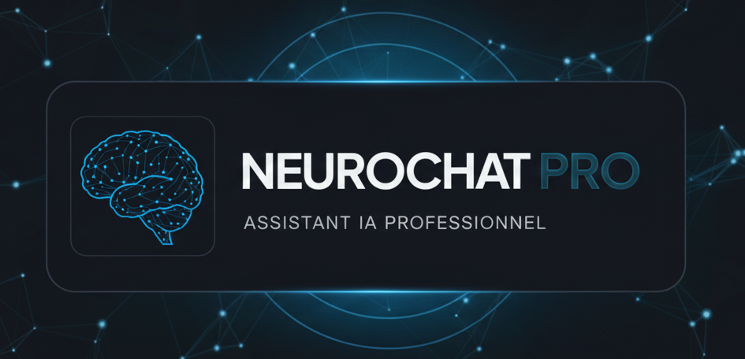

<div align="center">

</div>

# 🚀 NeuroChat Pro • Interface Immersive

**Une interface vocale immersive propulsée par Gemini Live API, offrant des conversations naturelles en temps réel avec visualisations audio dynamiques et support de la vision par ordinateur.**

---

## 📋 Table des matières

- [Présentation](#-présentation)
- [Stack technique](#-stack-technique)
- [Fonctionnalités principales](#-fonctionnalités-principales)
- [Prérequis](#-prérequis)
- [Installation](#-installation)
- [Configuration](#-configuration)
- [Lancement](#-lancement)
- [Structure du projet](#-structure-du-projet)
- [Variables d'environnement](#-variables-denvironnement)
- [Contribuer](#-contribuer)
- [Licence](#-licence)

---

## 🎯 Présentation

**NeuroChat Pro** est une application web moderne qui transforme l'interaction avec l'intelligence artificielle en une expérience immersive et naturelle. Grâce à l'API Gemini Live de Google, l'application permet des conversations vocales bidirectionnelles en temps réel, avec support de la vision par ordinateur, transcriptions automatiques et un système de personnalités multiples.

L'interface propose un design premium avec des visualisations audio dynamiques, des effets de glassmorphism et une expérience utilisateur soignée.

---

## 🛠️ Stack technique

### Core
- **React** `^19.2.0` - Bibliothèque UI moderne
- **TypeScript** `~5.8.2` - Typage statique pour la robustesse du code
- **Vite** `^6.2.0` - Build tool et dev server ultra-rapide

### APIs & Services
- **@google/genai** `^1.30.0` - SDK officiel Gemini Live API
- **Gemini 2.5 Flash** - Modèle de langage avec support audio natif

### Styling
- **Tailwind CSS** (via CDN) - Framework CSS utility-first
- **Google Fonts** - Typographie premium (Inter, Plus Jakarta Sans)

### Audio & Media
- **Web Audio API** - Traitement audio en temps réel
- **MediaStream API** - Capture microphone et caméra
- **Canvas API** - Visualisations et traitement d'images

---

## ✨ Fonctionnalités principales

### 🎙️ Communication vocale
- **Conversation bidirectionnelle** en temps réel avec latence minimale
- **Interruption naturelle** - possibilité d'interrompre l'IA pendant qu'elle parle
- **Qualité audio optimisée** - échantillonnage à 16kHz (entrée) et 24kHz (sortie)
- **Gestion intelligente du buffer audio** pour une lecture fluide
- **6 voix distinctes** disponibles (Puck, Charon, Kore, Fenrir, Zephyr, Aoede)

### 👁️ Vision par ordinateur
- **Support vidéo en temps réel** - envoi de frames caméra à 1 FPS pour maintenir le contexte visuel
- **Partage d'écran** - analyse du contenu de l'écran en temps réel (0.5 FPS)
- **Preview Picture-in-Picture** - aperçu de la caméra/écran avec indicateur visuel
- **Vue agrandie** - mode plein écran pour la visualisation
- **Sélection de caméra** - choix parmi les périphériques disponibles
- **Activation/désactivation** à la volée pendant la conversation

### 🎨 Visualisations audio
- **Visualiseur premium** avec particules animées et effets de réseau
- **Analyse fréquentielle** multi-couches (basses, médiums, aigus)
- **Visualisation d'entrée** - feedback visuel du microphone
- **Thème dynamique** adapté à la personnalité active
- **Mode veille élégant** avec animation de respiration

### 🎭 Système de personnalités
- **Personnalité personnalisable** avec éditeur intégré
- **Instructions système** configurables par personnalité
- **Voix distinctes** pour chaque personnalité
- **Thèmes visuels adaptatifs** avec couleurs et effets uniques
- **Persistance locale** - sauvegarde automatique dans localStorage

### 🎨 Interface utilisateur
- **Design glassmorphism** avec effets de flou et transparence
- **Animations fluides** et transitions soignées
- **Responsive design** - optimisé pour desktop et mobile
- **Mode sombre premium** avec effets de lueur et gradients
- **Indicateur de latence** en temps réel
- **Système de notifications** (Toast) pour le feedback utilisateur

### 🔧 Fonctionnalités techniques
- **Reconnexion automatique** avec backoff exponentiel (jusqu'à 5 tentatives)
- **Gestion d'erreurs robuste** avec retry automatique
- **Optimisation des performances** - downscaling intelligent des frames vidéo
- **Gestion mémoire** - nettoyage automatique des ressources

---

## 📦 Prérequis

Avant de commencer, assurez-vous d'avoir installé :

- **Node.js** `>= 18.0.0` (recommandé : LTS)
- **npm** `>= 9.0.0` ou **yarn** `>= 1.22.0` ou **pnpm** `>= 8.0.0`
- **Clé API Gemini** - Obtenez-la sur [Google AI Studio](https://aistudio.google.com/apikey)

### Navigateurs supportés
- Chrome/Edge `>= 120` (recommandé)
- Firefox `>= 121`
- Safari `>= 17` (support limité pour certaines fonctionnalités audio)

> ⚠️ **Note** : Les fonctionnalités audio/vidéo nécessitent HTTPS en production ou `localhost` en développement.

---

## 🚀 Installation

### 1. Cloner le repository

```bash
git clone https://github.com/votre-username/neuroChat-Live-Immersive-Pro.git
cd neuroChat-Live-Immersive-Pro
```

### 2. Installer les dépendances

```bash
npm install
```

ou avec yarn :

```bash
yarn install
```

ou avec pnpm :

```bash
pnpm install
```

### 3. Configuration des variables d'environnement

Créez un fichier `.env` à la racine du projet :

```bash
# .env
GEMINI_API_KEY=votre_cle_api_gemini_ici
```

> 💡 **Astuce** : Le fichier `.env` est généralement ignoré par Git. Ne commitez jamais votre clé API !

---

## ⚙️ Configuration

### Variables d'environnement

| Variable | Description | Requis | Exemple |
|----------|-------------|--------|---------|
| `GEMINI_API_KEY` | Clé API Google Gemini | ✅ Oui | `AIzaSy...` |

### Configuration Vite

Le projet utilise Vite avec les configurations suivantes :

- **Port de développement** : `3000`
- **Host** : `0.0.0.0` (accessible depuis le réseau local)
- **Alias de chemin** : `@/` pointe vers la racine du projet

### Configuration TypeScript

- **Target** : ES2022
- **Module** : ESNext
- **JSX** : React-jsx
- **Paths** : Support des alias `@/*`

---

## 🎬 Lancement

### Mode développement

```bash
npm run dev
```

L'application sera accessible sur `http://localhost:3000`

> 🔥 **Hot Module Replacement (HMR)** : Les modifications sont rechargées automatiquement.

### Build de production

```bash
npm run build
```

Les fichiers optimisés seront générés dans le dossier `dist/`.

### Prévisualisation du build

```bash
npm run preview
```

Permet de tester le build de production localement avant déploiement.

---

## 📁 Structure du projet

```
neuroChat-Live-Immersive-Pro/
├── components/                    # Composants React réutilisables
│   ├── AudioInputVisualizer.tsx  # Visualisation de l'entrée audio
│   ├── ControlPanel.tsx          # Panneau de contrôle principal
│   ├── Header.tsx                # En-tête de l'application
│   ├── LatencyIndicator.tsx      # Indicateur de latence
│   ├── Loader.tsx                # Composant de chargement
│   ├── PersonalityEditor.tsx     # Éditeur de personnalité
│   ├── PersonalitySelector.tsx   # Sélecteur de personnalités
│   ├── Toast.tsx                 # Système de notifications
│   ├── Tooltip.tsx               # Infobulles
│   ├── Visualizer.tsx            # Visualiseur audio Canvas
│   └── VoiceSelector.tsx         # Sélecteur de voix
├── utils/                        # Utilitaires
│   └── audioUtils.ts             # Fonctions de traitement audio
├── dist/                         # Build de production (généré)
├── App.tsx                       # Composant principal de l'application
├── index.tsx                     # Point d'entrée React
├── index.html                    # Template HTML
├── types.ts                      # Définitions TypeScript
├── constants.ts                  # Constantes (personnalités, config)
├── systemConfig.ts               # Configuration système (instructions IA)
├── metadata.json                 # Métadonnées de l'application
├── vite.config.ts                # Configuration Vite
├── tsconfig.json                 # Configuration TypeScript
├── package.json                  # Dépendances et scripts
├── .env                          # Variables d'environnement (à créer)
├── .gitignore                    # Fichiers ignorés par Git
├── README.md                     # Documentation (ce fichier)
└── ROADMAP.md                    # Roadmap du projet
```

### Description des composants principaux

#### `App.tsx`
Composant racine gérant :
- L'état de connexion à Gemini Live
- La gestion des flux audio/vidéo
- La coordination entre les différents composants
- Les effets visuels de fond
- La reconnexion automatique
- La gestion des personnalités

#### `components/ControlPanel.tsx`
Interface de contrôle avec :
- Bouton de connexion/déconnexion
- Affichage de la personnalité active
- Toggle caméra et partage d'écran
- Sélection de caméra
- Indicateurs de statut
- Éditeur de personnalité

#### `components/Visualizer.tsx`
Visualiseur audio Canvas avec :
- Système de particules animées
- Analyse fréquentielle en temps réel
- Effets de réseau et connexions
- Thème adaptatif selon la personnalité

#### `components/PersonalityEditor.tsx`
Éditeur de personnalité avec :
- Modification du nom et description
- Édition des instructions système
- Sélection de la voix
- Choix de la couleur de thème
- Sauvegarde dans localStorage

#### `utils/audioUtils.ts`
Utilitaires audio :
- Conversion PCM Int16 ↔ Float32
- Encodage/décodage Base64
- Création de blobs audio pour Gemini
- Décodage des données audio reçues

---

## 🔐 Variables d'environnement

### Configuration requise

Créez un fichier `.env` à la racine du projet avec :

```env
GEMINI_API_KEY=votre_cle_api_ici
```

### Sécurité

- ⚠️ **Ne jamais commiter** le fichier `.env` dans Git
- ✅ Le fichier `.env` est déjà dans `.gitignore`
- 🔒 En production, utilisez des variables d'environnement sécurisées (Vercel, Netlify, etc.)

### Obtention d'une clé API

1. Rendez-vous sur [Google AI Studio](https://aistudio.google.com/apikey)
2. Connectez-vous avec votre compte Google
3. Cliquez sur "Create API Key"
4. Copiez la clé générée dans votre fichier `.env`

---

## 🤝 Contribuer

Les contributions sont les bienvenues ! Voici comment participer :

### Workflow de contribution

1. **Fork** le projet
2. **Créez une branche** pour votre feature (`git checkout -b feature/AmazingFeature`)
3. **Commitez** vos changements (`git commit -m 'Add some AmazingFeature'`)
4. **Push** vers la branche (`git push origin feature/AmazingFeature`)
5. **Ouvrez une Pull Request**

### Bonnes pratiques

#### Code Style
- Utilisez **TypeScript** strict
- Suivez les conventions de nommage React (PascalCase pour les composants)
- Utilisez des **hooks React** pour la logique d'état
- Préférez les **fonctions composants** aux classes

#### Formatage
- Utilisez **Prettier** (si configuré) ou formatez manuellement
- Indentation : **2 espaces**
- Guillemets : **simples** pour JSX, **doubles** pour HTML

#### Commits
- Utilisez des messages de commit clairs et descriptifs
- Format recommandé : `type: description`
  - `feat:` Nouvelle fonctionnalité
  - `fix:` Correction de bug
  - `docs:` Documentation
  - `style:` Formatage, CSS
  - `refactor:` Refactoring
  - `test:` Tests
  - `chore:` Maintenance

#### Tests
- Testez vos modifications localement avant de soumettre
- Vérifiez que l'application compile sans erreurs
- Testez les fonctionnalités audio/vidéo sur différents navigateurs

#### Documentation
- Mettez à jour le README si nécessaire
- Ajoutez des commentaires pour le code complexe
- Documentez les nouvelles fonctionnalités

### Structure des Pull Requests

Une PR idéale contient :
- **Description claire** du changement
- **Screenshots/GIFs** pour les changements UI
- **Tests** effectués
- **Checklist** de vérification

---

## 📄 Licence

Ce projet est sous licence **MIT**.

```
MIT License

Copyright (c) 2025 NeuroChat Pro

Permission is hereby granted, free of charge, to any person obtaining a copy
of this software and associated documentation files (the "Software"), to deal
in the Software without restriction, including without limitation the rights
to use, copy, modify, merge, publish, distribute, sublicense, and/or sell
copies of the Software, and to permit persons to whom the Software is
furnished to do so, subject to the following conditions:

The above copyright notice and this permission notice shall be included in all
copies or substantial portions of the Software.

THE SOFTWARE IS PROVIDED "AS IS", WITHOUT WARRANTY OF ANY KIND, EXPRESS OR
IMPLIED, INCLUDING BUT NOT LIMITED TO THE WARRANTIES OF MERCHANTABILITY,
FITNESS FOR A PARTICULAR PURPOSE AND NONINFRINGEMENT. IN NO EVENT SHALL THE
AUTHORS OR COPYRIGHT HOLDERS BE LIABLE FOR ANY CLAIM, DAMAGES OR OTHER
LIABILITY, WHETHER IN AN ACTION OF CONTRACT, TORT OR OTHERWISE, ARISING FROM,
OUT OF OR IN CONNECTION WITH THE SOFTWARE OR THE USE OR OTHER DEALINGS IN THE
SOFTWARE.
```

---

## 🔗 Liens utiles

- [Documentation Gemini Live API](https://ai.google.dev/gemini-api/docs)
- [Google AI Studio](https://aistudio.google.com/)
- [Documentation React](https://react.dev/)
- [Documentation Vite](https://vitejs.dev/)
- [Documentation Tailwind CSS](https://tailwindcss.com/)
- [Web Audio API](https://developer.mozilla.org/en-US/docs/Web/API/Web_Audio_API)

---

## 📞 Support

Pour toute question ou problème :
- Ouvrez une [Issue](https://github.com/votre-username/neuroChat-Live-Immersive-Pro/issues)
- Consultez la [documentation](https://github.com/votre-username/neuroChat-Live-Immersive-Pro/wiki)
- Consultez le [ROADMAP.md](./ROADMAP.md) pour voir les fonctionnalités à venir

---

<div align="center">
Made with ❤️ using Gemini Live API
</div>
